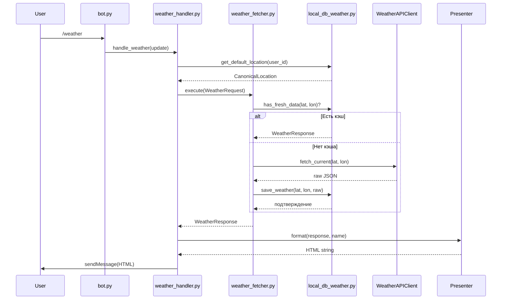
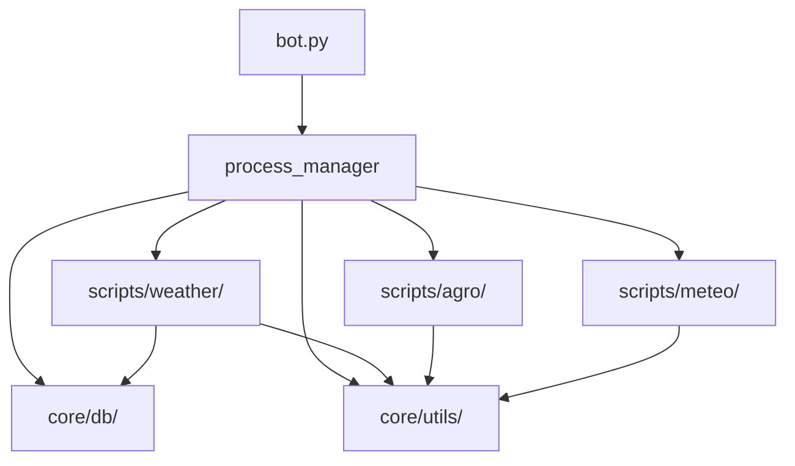

Конечно. Ниже — **глобальный архитектурный документ в формате Markdown**, описывающий структуру проекта с фокусом на:

- ✅ **блочную модульность** (каждый скрипт — независимый, тестируемый блок),  
- ✅ **единые контракты данных** (вход/выход по строгим схемам),  
- ✅ **централизованный обмен данными** (через `ProcessManager`, а не глобальные переменные),  
- ✅ **безопасность и валидацию на границах**,  
- ✅ **совместимость с `python-telegram-bot`**.

Файл предназначен для включения в `docs/architecture.md` вашей системы.

---

# 🏗️ Архитектура Telegram-бота: блочная структура и контракты данных

> Версия: 1.0  
> Последнее обновление: 27 декабря 2025 г.  
> Цель: обеспечение предсказуемого, расширяемого и безопасного взаимодействия между компонентами.

---

## 🔷 1. Общие принципы проектирования

### 1.1. Блочный подход
- Каждый исполняемый скрипт (`*.py`) — **самодостаточный блок** с чётко определённым:
  - **входом** (`InputSchema`),
  - **выходом** (`OutputSchema`),
  - **побочными эффектами** (запись в БД, вызов API — только через dependency injection).
- Блоки **не используют глобальные переменные** (кроме `process_manager` как dependency container).

### 1.2. Единая система обмена данными
- Все данные передаются **по значению** (не по ссылке).
- Все структуры — **валидируемые Pydantic-модели** или **примитивы**.
- Нет прямого доступа к БД/API из обработчиков — только через **инъекцию зависимостей**.

### 1.3. Безопасность по границам
- **Санитизация** — на входе (в обработчиках Telegram).
- **Валидация** — на выходе внешних систем (API, БД).
- **Экранирование** — на выходе (перед отправкой в Telegram).

---

## 🔷 2. Глобальный координатор: `process_manager.py`

### Роль
Централизованный контейнер зависимостей и жизненного цикла. **Единственная точка инициализации** всех сервисов.

### Структура
```python
class ProcessManager:
    config: BotConfig
    central_db: CentralDB
    weather_db: WeatherCacheDB
    weather_client: WeatherAPIClient
    geocoder: GeocodingClient
    location_resolver: LocationResolver
    cache_manager: CacheManager
    # + методы initialize()/shutdown()
```

### Правила использования
- Доступен **глобально**, но **только для чтения** после `initialize()`.
- **Не содержит состояния бизнес-логики** — только инфраструктурные зависимости.
- В тестах заменяется на mock через monkeypatch.

---

## 🔷 3. Структура папки `scripts/`

Каждый подмодуль (`weather/`, `agro/`, `meteo/`) следует единому шаблону:

```
scripts/
└── <module>/
    ├── __init__.py
    ├── <module>_handler.py        # Обработчики команд Telegram
    ├── _services/                 # Бизнес-логика (блоки)
    │   ├── input_validator.py     # Валидация входа
    │   ├── data_fetcher.py        # Получение данных
    │   ├── data_processor.py      # Обработка
    │   └── output_formatter.py    # Форматирование
    └── _io/
        └── templates/             # Шаблоны вывода (Jinja2, autoescape=True)
```

---

## 🔷 4. Контракты данных: единые схемы

### 4.1. Общие схемы (в `core/models/`)

```python
# core/models/location.py
class CanonicalLocation(BaseModel):
    id: str                    # geo:55.7558:37.6176
    lat: float = Field(ge=-90, le=90)
    lon: float = Field(ge=-180, le=180)
    display_name: str
    timezone: str

# core/models/weather.py
class WeatherRequest(BaseModel):
    user_id: int
    location: CanonicalLocation

class WeatherResponse(BaseModel):
    temp: float = Field(ge=-80, le=60)
    description: str
    timestamp: datetime
    source: str                # "openweather", "yr", etc.
```

> ✅ Все блоки **принимают и возвращают только такие модели**.

---

## 🔷 5. Детализация модуля `weather/`

### 5.1. Обработчик: `weather_handler.py`
- **Вход**: `Update` (от Telegram) → извлекает `user_id`.
- **Выход**: `str` (HTML-сообщение для Telegram).
- **Зависимости**:  
  `process_manager.central_db`,  
  `process_manager.weather_db`,  
  `process_manager.weather_presenter`.

- **Контракт**:  
  ```python
  async def handle_weather(update: Update) -> None:
      # 1. Получить локацию → WeatherRequest
      # 2. Вызвать weather_fetcher.execute(WeatherRequest)
      # 3. Отправить результат
  ```

### 5.2. Блок: `_services/weather_fetcher.py`
- **Вход**: `WeatherRequest`
- **Выход**: `WeatherResponse`
- **Логика**:
  - проверка кэша (`weather_db.has_fresh_data`),
  - fallback на API (`weather_client.fetch_current`),
  - валидация ответа (`validator.validate_weather_response`),
  - сохранение в кэш.

- **Исключения**:  
  Все ошибки → логируются и пробрасываются как `WeatherFetchError`.

### 5.3. Блок: `_services/output_formatter.py` → `WeatherPresenter`
- **Вход**: `WeatherResponse`, `display_name: str`
- **Выход**: `str` (HTML)
- **Безопасность**:  
  Использует Jinja2 с `autoescape=True`.

---

## 🔷 6. Управление локациями: FSM-блок

### Обработчик: `location_fsm.py`
- **Состояния**: `LOCATION_INPUT`
- **Триггеры**:
  - `filters.LOCATION` → `handle_location_geo`
  - `filters.TEXT` → `handle_location_text`

### Блок: `_services/location_resolver.py`
- **Вход**: `str` (название) или `(lat, lon)`
- **Выход**: `CanonicalLocation`
- **Этапы**:
  1. Санитизация (`sanitize_user_input`),
  2. Геокодинг (`geocoder.geocode`),
  3. Нормализация (`round(lat, 4)`),
  4. Reverse-геокодинг (для `display_name`).

---

## 🔷 7. Глобальные переменные и их замена

| Что было (антипаттерн) | Что используется (паттерн) |
|------------------------|----------------------------|
| `global DB_CONNECTION` | `process_manager.central_db` |
| `API_KEY = os.getenv(...)` в каждом файле | `process_manager.config.weather_api_key` |
| Прямой вызов `requests.get(...)` | `process_manager.weather_client.fetch_current(...)` |
| HTML-конкатенация | `process_manager.weather_presenter.format(...)` |

> ✅ **Нет глобального состояния**, кроме immutable `ProcessManager`.

---

## 🔷 8. Поток данных: пример запроса погоды



---

## 🔷 9. Требования к новым блокам

Любой новый скрипт в `scripts/<module>/` **обязан**:

1. Определять `InputSchema` и `OutputSchema` (Pydantic).
2. Принимать зависимости через `process_manager`.
3. Валидировать входные данные на границе.
4. Логировать ошибки через `core/utils/error_handler.py`.
5. Иметь unit-тест в `tests/unit/scripts/<module>/`.

---

## 🔷 10. Зависимости между модулями



> Нет циклических зависимостей. Все связи — через `process_manager`.

---

## 🔷 Заключение

Эта архитектура обеспечивает:
- **Предсказуемость**: каждый блок — чёрный ящик с известным входом/выходом,
- **Безопасность**: санитизация, валидация, экранирование на всех границах,
- **Расширяемость**: новый модуль = копия шаблона + новые схемы,
- **Тестируемость**: все зависимости инъектируются, глобальное состояние отсутствует.

Документ служит **единой точкой истины** для разработчиков и CI/CD-системы.

--- 

Файл можно сохранить как `docs/architecture.md` и поддерживать в актуальном состоянии через pull request checklist.

Если вы хотите, я могу:
- сгенерировать аналогичные документы для `agro/` и `meteo/`,
- подготовить шаблон `InputSchema`/`OutputSchema` для новых модулей,
- автоматизировать проверку архитектуры через `pytest` (например, запрет на `import requests` вне `api_client.py`).

Готов к дальнейшей детализации.